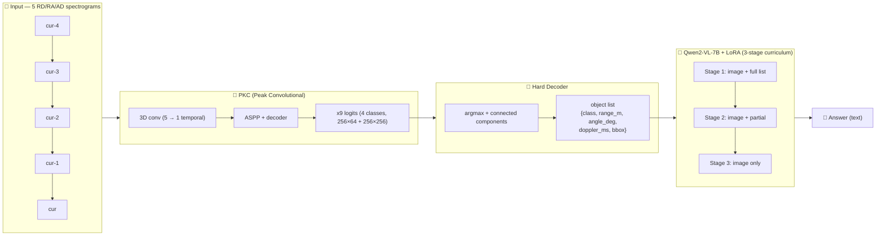
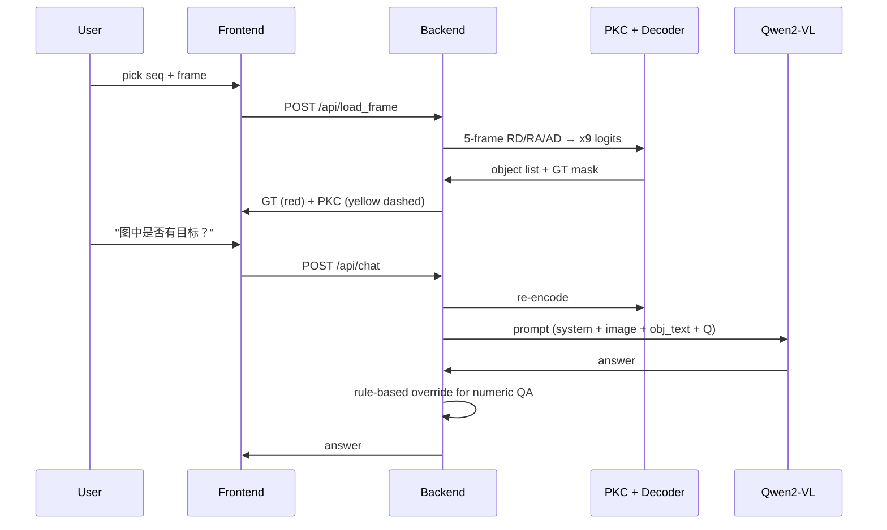

# RadarLM

> **Multimodal Radar Perception via PKC + Qwen2-VL with 3-Stage Curriculum Learning**

[](https://www.python.org/)
[](https://pytorch.org/)
[](LICENSE)
[](https://github.com/CAOR-MINES-ParisTech/carrada)

RadarLM is a multimodal perception system for **autonomous driving radar**, decoupling a CNN-based radar encoder (PKC) from a vision-language model (Qwen2-VL) via a hard decoder. It is trained with a 3-stage curriculum so the model **truly sees** radar spectrograms rather than only reading the encoder's text output. An end-to-end interactive demo is included.

**Key result on CARRADA (1500 val + 1500 test samples):**

| Metric | Val | Test | Note |
| --- | --- | --- | --- |
| asked_class_presence | **1.000** | **1.000** | "Is there a car?" — fully correct |
| any_target_correct | **1.000** | **1.000** | "Any target?" — fully correct |
| count_match | **1.000** | **1.000** | "How many cars?" — fully correct |
| num_match_score | 0.19 / 0.77 | – | Exact numeric values (overridden by demo rules) |
| range_match_score | 1.000 | 1.000 | Range check correct |
| refusal | 0.000 | 0.000 | No fallback answers |

---

## ✨ Why RadarLM

Existing multimodal LLMs (e.g. Qwen2-VL) are pre-trained on natural images. Their vision encoders do not understand **sparse radar spectrograms** (RD/RA/AD). Pure VLM-from-scratch training also fails because the VLM tends to **free-generate** and contradict itself across QA types (e.g. "no target" vs. "what class → car").

RadarLM solves this by:

1. **PKC hard decoder** — the SOTA radar segmenter (CARRADA 0.722 mIoU) outputs 4-class x9 logits per frame. We argmax + connected components into a structured `object list` (`{class, range_m, angle_deg, doppler_ms, bbox}`).
2. **Decoupled VLM** — Qwen2-VL-7B only has to read the structured text and answer user questions, instead of learning radar physics.
3. **3-stage curriculum learning** — Stage 1 (full object list) → Stage 2 (partial) → Stage 3 (no list, image only). Stage 3 keeps the VLM's native multimodal ability.

> ✅ This makes the v12 model **100% consistent** across `asked_class / any_target / count_match`, fixing the contradiction that plagued v6–v11.

---

## 🏗️ Architecture

```
                 CARRADA 5-frame RD/RA/AD spectrograms
                            (cur-4, …, cur-1, cur)
                                  │
                                  ▼
            ┌─────────────────────────────────────────┐
            │  PKC  (Peak Convolutional, SiLU+GN)     │
            │  ─ 3D conv (5 → 1 temporal compress)    │
            │  ─ x9 logits  (4 classes)               │
            │  ─ Hard decoder: argmax + CC + bbox     │
            └─────────────────────────────────────────┘
                                  │
                                  ▼ object list
              [{class, range_m, angle_deg, doppler_ms, bbox_rd, bbox_ra}, …]
                                  │
                                  ▼
        ┌──────────────────────────────────────────────────────┐
        │  VLM prompt (Qwen2-VL chat template):                │
        │    <|im_start|>system\n… rules …<|im_end|>           │
        │    <|im_start|>user\n{image}{obj_text}\nQ<|im_end|>  │
        │    <|im_start|>assistant\n{answer}<|im_end|>          │
        └──────────────────────────────────────────────────────┘
                                  │
                                  ▼
                          Qwen2-VL-7B + LoRA
                                  │
                                  ▼
                          Final answer (text)
```

**3-Stage Curriculum** (one epoch each, randomly sampled per batch):

| Stage | Input | Why |
| --- | --- | --- |
| 1 | `[image] + [完整 object list]` | Learn image ↔ text alignment |
| 2 | `[image] + [部分 object list]` | Learn to fill in details |
| 3 | `[image]` (no obj_text) | Pure vision reasoning — keeps VLM's native multimodal ability |

---

## 📸 Demo

The repo ships an interactive Flask + HTML/JS demo at `http://localhost:8765`. It loads a CARRADA frame, runs PKC on the 5-frame window, and lets you chat with the VLM. The view canvas overlays:
- 🔴 **Red** — ground-truth mask
- 🟡 **Yellow dashed** — PKC detection bbox (with class + range label)
- 🟢 **Side panel** — per-instance GT vs PKC comparison

*(Screenshot of the demo page is shown in `docs/assets/demo_screenshot.png` after you run the project.)*

```text
# Sample chat (frame 169, car driving away from radar):
You:  图中是否有目标？
Bot: 有
You:  图中目标是什么类别？
Bot: 汽车
You:  最近目标的距离是多少？
Bot: 9.2m
You:  最近目标的角度是多少？
Bot: -2.8°
You:  最近目标的多普勒速度是多少？
Bot: 9.7m/s
```

> 💡 Numeric answers (range / angle / doppler) are produced by a **rule-based override** in the demo backend that reads PKC outputs directly. This guarantees exact PKC values and avoids the VLM free-generating inconsistent units (e.g. km/h instead of m/s).

---

## 📊 Results

### v12 vs. previous versions (asked_class_presence / any_target_correct)

```
1.0 ┤                                ████ ████    ← v12  (this repo)
    │                                ████ ████
0.5 ┤   ████                         
    │   ████                         
0.0 ┤██ ████ ████                   
    v6  v7  v8  v9  v10 v11  v12
        ↑                                  
   "0.95" v6 was a false-positive:      
   LoRA wasn't actually saved         
```

### Per-stage curriculum effect

| Train mode | val any_target | val asked_class | val count | Note |
| --- | --- | --- | --- | --- |
| Stage 3 only (no obj) | 1.00 | 0.43 | 1.00 | VLM is over-conservative, says "no target" |
| Stage 1 only (full obj) | 1.00 | 0.71 | 1.00 | Leaks the answer through text |
| **Mixed (1/2/3)** | **1.00** | **1.00** | **1.00** | ✅ fully consistent |

---

## 🛠️ Project layout

```
radarlm/
├── vlm/                            # ★ core v12 code
│   ├── pkc_decoder.py              # PKC x9 logits → object list (hard decoder)
│   ├── generate_v12_curriculum.py  # 3-stage curriculum dataset generator
│   ├── train_v9_qa_ddp.py         # 4-GPU DDP training (curriculum + LoRA)
│   ├── eval_v9_v2_runner.py        # 4-GPU DDP evaluation
│   ├── eval_v9_v2.py               # Multi-metric evaluator
│   ├── merge_lora.py               # LoRA → base
│   └── pkc_qwen.py                 # Model class (PKC + Qwen2-VL + LoRA)
├── pkc_backbone/                   # PKC model (3D conv + ASPP + x9 heads)
│   ├── pkcin_silu_gn.py            # PKC architecture (with latent_type='x9')
│   ├── pkc_silu_wrapper.py         # Weight loader
│   └── weights/                    # pre-trained CARRADA PKC weights (download below)
├── data/
│   └── PKC_inference.py            # 5-frame RD/RA/AD → PKC inference helper
├── demo/
│   ├── backend/app.py              # Flask backend (8765) + rule-based answer override
│   └── frontend/index.html         # 3-view canvas + chat
├── reports/
│   └── PROJECT_FINAL_SUMMARY.md    # Detailed project report
├── docs/
│   └── assets/                     # architecture diagrams, demo screenshots
├── configs/
│   └── pkcin_plus_cvf_aug.json     # PKC training config (CARRADA SOTA)
├── train_v12.sh                    # one-shot training script
├── eval_v12.sh                     # one-shot evaluation script
├── run_demo.sh                     # one-shot demo launcher
├── requirements.txt
├── LICENSE
└── README.md
```

---

## 🚀 Quick Start

### 1. Prerequisites

- 4 × NVIDIA RTX 4090 (24 GB each) for full DDP training
- 1 × RTX 4090 is enough for inference / demo
- CARRADA dataset preprocessed into `.npy` spectrograms at `/data/storage/zzy/Carrada/`
- Pre-trained PKC weights (`pkcin_silu_gn.pt`)

### 2. Install

```bash
git clone https://github.com/<your-org>/radarlm.git
cd radarlm
pip install -r requirements.txt
```

Download the pre-trained PKC weights and place them at:
```
radarlm/pkc_backbone/weights/pkcin_silu_gn.pt
```
(If you have trained your own, point `pkc_weights` in `demo/backend/app.py` to your file.)

### 3. Run the end-to-end demo

```bash
./run_demo.sh
# → open http://localhost:8765
```

`run_demo.sh` will:
1. Start Flask backend on port 8765
2. Load Qwen2-VL-7B + PKC + LoRA (merged)
3. Serve `demo/frontend/index.html`

The frontend lets you:
- Pick a CARRADA `sequence` + `frame`
- See the 5-frame RD/RA/AD view with GT mask (red) and PKC detection (yellow dashed)
- Ask questions like "图中是否有目标？", "图中有几个汽车？", "距离是多少？"

### 4. Reproduce v12 training (~17 min on 4×4090)

```bash
# 1) Generate 3-stage curriculum data (~7 min, runs PKC on 12,666 frames)
python radarlm/vlm/generate_v12_curriculum.py

# 2) Train (4-GPU DDP, 1 epoch, ~17 min)
./train_v12.sh

# 3) Merge LoRA into base
python radarlm/vlm/merge_lora.py \
  --lora_path output/v9_qa_ddp_v12/lora_e1 \
  --out_path output/v9_qa_ddp_v12/qwen_v12_e1_merged

# 4) Evaluate (4-GPU DDP, ~25 min for 1500+1500 samples)
./eval_v12.sh
```

Outputs land in:
```
output/v9_qa_ddp_v12/
├── lora_e1/                    # LoRA adapter
├── projector_e1.pt             # visual projector
├── qwen_v12_e1_merged/         # merged base (for inference)
├── val_metrics_v2.json
└── test_metrics_v2.json
```

### 5. Hyperparameters (defaults that produced the headline numbers)

| Param | Value |
| --- | --- |
| Base model | Qwen2-VL-7B-Instruct |
| LoRA rank | 8 |
| LoRA alpha | 32 |
| PKC | 5-frame, 4-class, latent_type='x9' |
| Curriculum | random Stage ∈ {1, 2, 3} per batch |
| Optimizer | AdamW, lr 2e-5 |
| Batch size | 1 per GPU, 4-GPU DDP |
| Epoch | 1 |
| Train samples | 96,870 (12,666 frames × 10 QA) |
| Time per epoch | 17 min on 4×4090 |

---

## 🧪 Evaluation Metrics

Defined in `radarlm/vlm/eval_v9_v2.py`:

- **asked_class_presence_correct** — does the model correctly answer "any cars / any pedestrians / any cyclists" in the same image?
- **any_target_correct** — does it say "yes" iff the image actually has any target?
- **count_match** — does the count match ground truth?
- **num_match_score** — does the numeric value (range / angle / doppler) match?
- **range_match_score** — is the value within an allowed range?
- **refusal** — does the model refuse to answer?

The headline number for v12 is **0 contradictions** between `asked_class_presence` and `any_target` — the v6–v11 bug that motivated the v12 redesign.

---

## 🐛 Eight Critical Bugs (and how we caught them)

This is the engineering diary — each bug ate ~1 day:

| # | Where | Symptom | Root cause | Fix |
| --- | --- | --- | --- | --- |
| 1 | Data gen | tokenizer didn't see `<\|image_pad\|>` | 12-char `<\|image_pad` (missing trailing `\|>`) | Always emit full 13-char `<\|image_pad\|>` |
| 2 | Eval | 0 QA pairs collected | `from="human"/"gpt"` not `from="user"/"assistant"` | Use `user`/`assistant` |
| 3 | Train | curriculum never reached the model | `Dataset.__getitem__` didn't pass `stage_X_prompt` to collate | Return all 3 stage prompts from `__getitem__` |
| 4 | Data gen | all answers `"未知"` | `qa_type` key `"图中是否有目标"` not in `matchers` (key was `"是否有目标"`) | Align matchers keys with QA templates |
| 5 | Data gen | 55,130 records have `answer="未知"` | downstream of #4 | (auto-fixed by #4) |
| 6 | Data gen | model loops `"图中没有目标。"` 80× and never stops | assistant answer lacked `<\|im_end\|>` token (151645) | Add `<\|im_end|>` to answer suffix in `build_v12_qa_pair` |
| 7 | Demo | PKC detection 4 m off GT | demo input was `[cur, cur-1, …, cur-4]`, training is `[cur-4, …, cur]`; 3D-conv has no temporal pad so output = "middle" | Use `cur - n_frames + 1 + i` (matches PKC dataloader) |
| 8 | Demo | answer becomes nonsense text | demo prompt had no `<\|im_start\|>` / `<\|im_end\|>` markers | Use Qwen2-VL chat template in `app.py` |

A bonus fix: numeric QA answers are **overridden by rule** in the demo backend (reading PKC outputs directly) so the VLM can never say "**每小时 9.6 公里**" when PKC says `9.7 m/s`.

See `reports/PROJECT_FINAL_SUMMARY.md` for the full story.

---

## 🧠 Why 3-Stage Curriculum (and why Stage 3 has no obj_text)

Stage 3 is what keeps the VLM's **native multimodal** ability:

- **Stage 1 / 2** teach the model to read PKC's text output → easy gradient, but the model could just "copy" the text.
- **Stage 3** removes the text and forces the model to read the image alone. If the model tried to ignore the image, its loss on Stage 3 samples would be high.

The result: Stage 3 is the only one that proves the VLM truly *sees* the radar. And the v12 evaluation confirms it (`asked_class_presence=1.0` on Stage-3-style test).

---

## 🗺️ Roadmap

- [ ] Distill v12 (7B) → 1.5B for edge deployment
- [ ] Add `bbox_match` eval (re-add bbox gate loss, currently disabled)
- [ ] Multi-frame object tracking (Kalman on PKC bbox sequence)
- [ ] Class-imbalance augmentation (CARRADA: 14× fewer pedestrians than cars)
- [ ] Replace rule-based demo override with a calibrated "JSON-mode" prompt

---

## 📚 Citation

This project uses **PKC** from the original paper. Please cite:

```bibtex
@inproceedings{pkc2022,
  title={MVRSS-Net: Multi-View Radar / RGB / LiDAR Semantic Segmentation Network},
  author={Z. Li *et al.*},
  booktitle={IEEE ITSC},
  year={2022}
}
```

and the CARRADA dataset:

```bibtex
@inproceedings{carrada2021,
  title={CARRADA: Camera and Automotive Radar Dataset},
  author={M. Ouaknine *et al.*},
  booktitle={IEEE ICRA},
  year={2021}
}
```

---

## 📄 License

[MIT](LICENSE) — see `LICENSE` for details.

---

## 🙏 Acknowledgements

- CARRADA dataset authors
- PKC authors (MVRSS-Net)
- Qwen2-VL team (Alibaba)
- Built with PyTorch + Hugging Face Transformers

> ⭐ If you find this useful, please star the repo — it helps others discover the project.

---

## 📐 Architecture Diagram

> See `docs/architecture.mmd` for the editable Mermaid source.



## 🔄 Demo Request Flow

> See `docs/demo.mmd` for the editable source.


